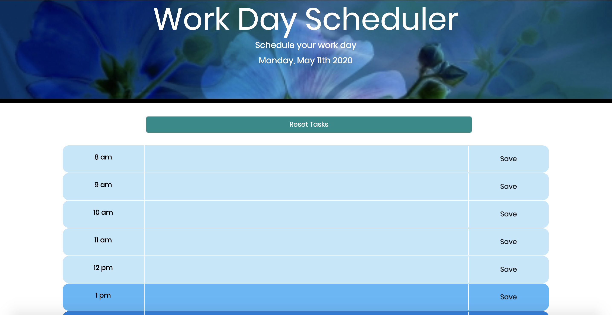

# Work-Day-Scheduler

## Description

I created a calendar application that functions to save events for each hour of the work day, display the current date, and indicate whether an event or time block is in the past, present or future by the color of the time block. 

## Table of Contents
* [Usage](#Usage)
* [Demonstration](#Demonstration)
* [Technologies](#Technologies)
* [Deployed-Link](#Deployed-Link)
* [Developer](#Developer)

## Usage

To use the Work Day Scheduler go to the [deployed-link](#Deployed-Link).

## Demonstration

## Technologies
* HTML
* CSS
* jQuery
* Local Storage
* Moment.js

## Deployed-Link
 
 https://meganlcoppins.github.io/Work-Day-Scheduler/

## Developer

Megan Coppins

https://github.com/MeganLCoppins/Work-Day-Scheduler
